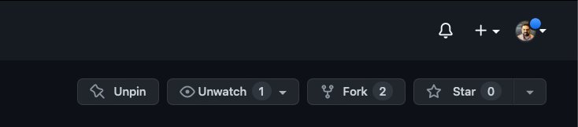

# AD - SBA - Core Java/Hibernate/JUnit - Instructor Version

## School Management System
### Business Requirement:
Your task is to create a basic School Management System
where students can register for courses, and view the
course assigned to them.
### Work-Flow:
Only students with the right credentials can log in.
Otherwise, a message is displayed stating: “Wrong Credentials”.
Valid students are able to see the courses they are registered for.
Valid students are able to register for any course in the system as
long as they are not already registered.

### Maven Project Requirements:

- [Amazon Corretto 11 JDK](https://docs.aws.amazon.com/corretto/latest/corretto-11-ug/downloads-list.html) 
- [Hibernate](https://mvnrepository.com/artifact/org.hibernate/hibernate-core) 
- [MariaDB](https://mvnrepository.com/artifact/org.mariadb.jdbc/mariadb-java-client)
- [H2 database - tests](https://mvnrepository.com/artifact/com.h2database/h2)
- [Project lombok](https://mvnrepository.com/artifact/org.projectlombok/lombok)
- [Junit jupiter api](https://mvnrepository.com/artifact/org.junit.jupiter/junit-jupiter-api)
- [Junit jupiter engine](https://mvnrepository.com/artifact/org.junit.jupiter/junit-jupiter-engine)
- [Junit jupiter param](https://mvnrepository.com/artifact/org.junit.jupiter/junit-jupiter-params)
- [Junit platform suite](https://mvnrepository.com/artifact/org.junit.platform/junit-platform-suite-engine)
- [Junit platform runner](https://mvnrepository.com/artifact/org.junit.platform/junit-platform-runner)

### Demonstration to fork GitHub repository
- click on `Fork`

- the action will duplicate the repository from the owner account
to your own account, giving you the ability to clone the project 
as the owner from your account. [More about forks](https://docs.github.com/en/pull-requests/collaborating-with-pull-requests/working-with-forks/about-forks)
---
#### Requirement 1 - Models:
Models requires:
- no args constructor 
- all args constructor
- required args constructor
- setters and getter
- toString (exclude collections to avoid infinite loops)
- override equals and hashcode methods (don't use lombok here)
- helper methods
##### Student (`@Table(name = "student")`):
| Field    | Datatype      | Description                 | Database attributes `@Column()`                                                                                                                                                                       | 
|----------|---------------|-----------------------------|-------------------------------------------------------------------------------------------------------------------------------------------------------------------------------------------------------|
 | email    | String        | Student’s unique identifier | Primary key, 50 character limit, name `email`                                                                                                                                                         |
 | name     | String        | Student’s name              | 50 character limit, not null, name `name`                                                                                                                                                             |
 | password | String        | Student’s password          | 50 character limit not null, name `password`                                                                                                                                                          |
 | courses  | List\<Course> | Student courses list        | Join table strategy name `student_courses` , name of student primary key column `student_email` and inverse primary key (courses) column `courses_id` , fetch type `eager`, cascade all except remove |

##### Course (`@Table(name = "course")`):

| Field      | Datatype       | Description              | Database attributes `@Column()`                                   | 
|------------|----------------|--------------------------|-------------------------------------------------------------------|
| id         | int            | Course unique identifier | Primary key                                                       |
| name       | String         | Course name              | 50 character limit, not null                                      |
| instructor | String         | Instructor name          | 50 character limit not null                                       |
| students   | List\<Student> | Course learners list     | fetch type `eager`, cascade all except remove, mappedBy `courses` | 

---
#### Requirement 2 - Data Access Object  (dao) interfaces:

##### StudentI:
| Abstract method         | Return type    | Parameters                    | Description                                                                                                     | 
|-------------------------|----------------|-------------------------------|-----------------------------------------------------------------------------------------------------------------|
| createStudent           | void           | Student                       | persist student to database, also handle commit,rollback, and exceptions                                        |
| getAllStudents          | List\<Student> | None                          | return all students from database, also handle commit,rollback, and exceptions                                  |
| getStudentByEmail       | Student        | String email                  | return student if exists, also handle commit,rollback, and exceptions                                           |
| validateStudent         | boolean        | String email, String password | match email and password to database to gain access to courses, also handle commit,rollback, and exceptions     |
| registerStudentToCourse | void           | String email, int courseId    | register a course to a student (collection to prevent duplication), also handle commit,rollback, and exceptions |
| getStudentCourses       | List\<Course>  | String email                  | get all the student courses list (use native query), also handle commit,rollback, and exceptions                | 

##### CourseI:
| Abstract method         | Return type   | Parameters                    | Description                                                                                                     | 
|-------------------------|---------------|-------------------------------|-----------------------------------------------------------------------------------------------------------------|
| createCourse            | void          | Course                        | persist course to database, also handle commit,rollback, and exceptions                                         |
| getAllCourses           | List\<Course> | None                          | return all courses from database, also handle commit,rollback, and exceptions                                   |
| getCourseById           | Course        | int courseId                  | return course if exists, also handle commit,rollback, and exceptions                                            |
---
#### Requirement 3 - Service layer:
implement interfaces:
- StudentService
- CourseService
---
#### Requirement 4 - Utility classes:
- hibernate configuration session factory helper
- data initializer helper (dummy data dump)
---
#### Requirement 5 - JUnit:
- Write at least one junit test
---
#### Project Tree example

#### Workflow example
